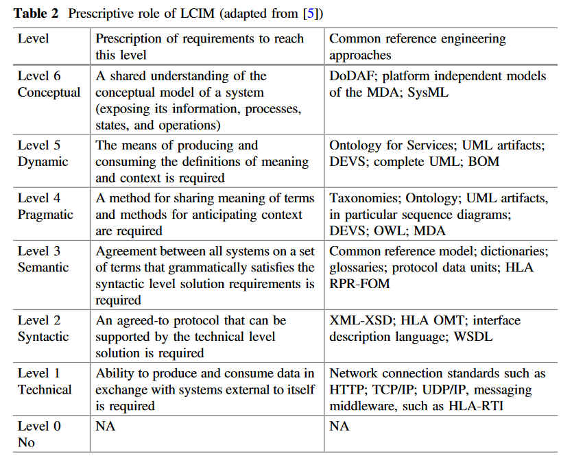
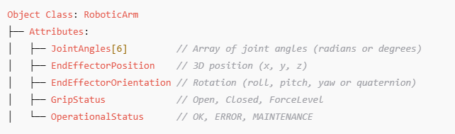
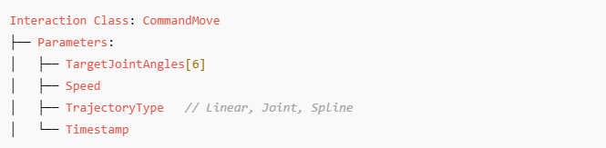
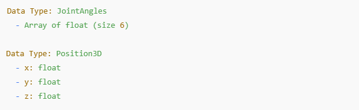
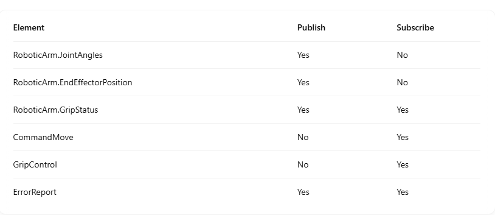
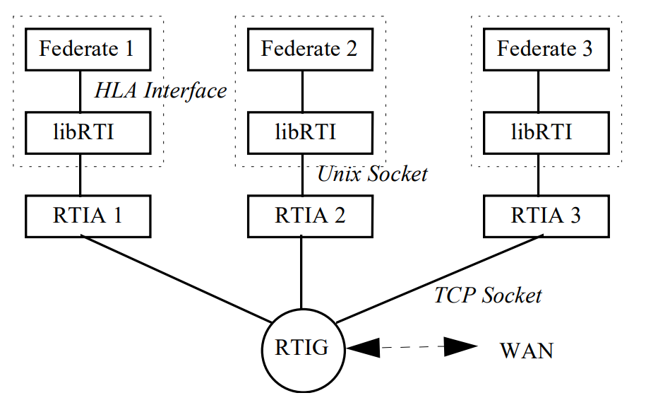
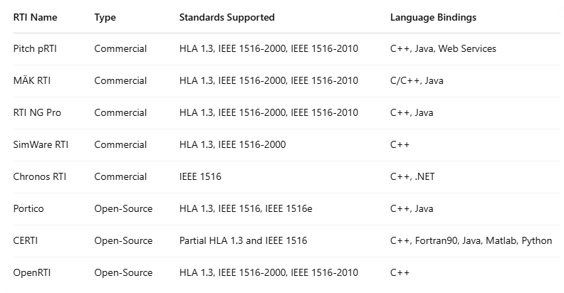
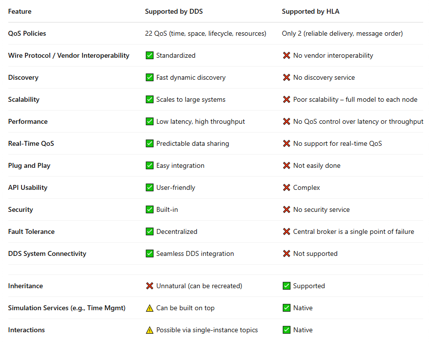

<!-- _class: centered -->
# The **H**igh **L**evel **A**rchitecture
### Overview

---
### /!\ Warning /!\

1 - I am not an expert of HLA.
2 - This presentation is aimed at providing some (hopefully useful) inputs to the WG...

---
### Agenda
- What do we mean by *federated* and *distributed* simulation...
- The issues of distributed simulation...
- A brief history of HLA...
- The main concepts of HLA
- The implementations of HLA
- HLA *vs.* DDS
- HLA today
- The Real Time Infrastructure (RTI)
  
---
### Distributed *vs.* federated simulation

#### Distributed simulation
- Multiple simulation components running on separate physical or virtual machines and working together to execute a unified simulation.

#### Federated simulation
- Multiple **independent** simulation systems (federates) **interoperating** within a common framework called a federation.
- A federation can be seen as a specific case of a distributed simulation where "simulation components" are actually "independent simulators"...

<!-- 
[ril-04] G. F. Riley, M. H. Ammar, R. M. Fujimoto, A. Park, K. Perumalla, and D. Xu, ‘A federated approach to distributed network simulation’, ACM Trans. Model. Comput. Simul., vol. 14, no. 2, pp. 116–148, Apr. 2004, doi: 10.1145/985793.985795.

[hui-16] W. Huiskamp and T. van den Berg, ‘Federated Simulations’, in Managing the Complexity of Critical Infrastructures: A Modelling and Simulation Approach, R. Setola, V. Rosato, E. Kyriakides, and E. Rome, Eds., Cham: Springer International Publishing, 2016, pp. 109–137. doi: 10.1007/978-3-319-51043-9_6. 
-->

---
### What is a federation

- **Federation**: A named set of **federate** applications and a common federation object model (FOM) that are used as a whole to achieve some specific objective. 
- **Federate**: A member of a federation; a single application that may be or is currently coupled with other software applications under a federation execution data (FED) or federation object model document data (FDD), and a runtime infrastructure (RTI).

---
### What do we expect from a federated simulation?

#### Composability

#### Interoperability

---
### The Levels of Conceptual Interoperability layers Model (LCIM)

<!--
[1] A. Tolk and J. Mugira, ‘Levels of Conceptual Interoperability’, presented at the 2003 Fall Simulation Interoperability Workshop, Orlando, Florida, Sep. 2003.
[2] A. Tolk, ‘The elusiveness of simulation interoperability - What is different from other interoperability domains?’, in 2018 Winter Simulation Conference (WSC), Dec. 2018, pp. 679–690. doi: 10.1109/WSC.2018.8632363.

-->

---
### LCIM and HLA
From [Hui]:

<!-- [1] W. Huiskamp and T. van den Berg, ‘Federated Simulations’, in Managing the Complexity of Critical Infrastructures: A Modelling and Simulation Approach, R. Setola, V. Rosato, E. Kyriakides, and E. Rome, Eds., Cham: Springer International Publishing, 2016, pp. 109–137. doi: 10.1007/978-3-319-51043-9_6. -->
>

---
### The issues of federated simulation (part 1)

#### Data distribution
- How to wire data from one simulation to another (communication protocols) 
- How to interface simulators that use diverse data formats (syntax)

#### Data alignment
- How to achieve **knowledge alignment** [Tolk et al., 2003] on the shared data (semantic)
- How to adapt shared information to make them consumable by the simulators with different data models,
- How to manage differences in scales (spatial and temporal)

<!--
[1] F. Cremona, M. Lohstroh, D. Broman, E. A. Lee, M. Masin, and S. Tripakis, ‘Hybrid co-simulation: it’s about time’, Softw Syst Model, vol. 18, no. 3, pp. 1655–1679, Jun. 2019, doi: 10.1007/s10270-017-0633-6.

[1] R. Fujimoto, ‘PARALLEL AND DISTRIBUTED SIMULATION’.

[1] B. P. Zeigler, Theory of Modeling and Simulation. Elsevier, 2019. doi: 10.1016/B978-0-12-813370-5.00002-X.

-->

---
### The issues of federated simulation (part 2)
#### Synchronization

##### Causality

- Events occurring within simulations must be processed with
respect to their timestamps order [Fujimoto, 2001]

#### Synchronization in time
- How to handle a consistent evolution of the simulations in time with respect to the casualty principal ?
- There are two time synchronization approaches [Fujimoto, 1998]: 
  - conservative: wait until events are safe to process
  - optimistic: allow local causality violations, but detect them and recover using rollback mechanism
  
#### Shared entities
- Concepts in the system that are represented at least in two different ways, and on which we may have concurrent access (e.g., the environment)
- Their state is common among the simulators that represent them.
  
---
### Parallel and distributed simulation
#### Objective

> "A synchronization algorithm is required to ensure that the parallel execution of
the simulation produces exactly the same results as a sequential execution on a single processor. In some cases approximate results are acceptable, but the bulk of the research in synchronization algorithms has focused on producing exactly the same results. One can show that this can be achieved by ensuring that
each LP processes events in timestamp order."

---
### The algorithms of distributed simulation
#### First generation algorithms
- block the execution of an LP until it can guarantee that an event with a smaller timestamp will not later be received.
- If each FIFO queue contains at least one message, the LP can simply pick the smallest timestamped message, remove it from its queue, and process it. If one or more FIFO queues are empty, the LP must block.
- Problem: deadlock due to waiting loops
- Solution: each LP sends *lookhead* messages $t$ stating that any future message will have a timestamp of at least $t$.
- Problem: if the lookahead is small, there will be a lot of null messages (*lookahead creep*)

---
### The algorithms of distributed simulation
#### Second generation algorithms
- Algorithms based on global synchronization points.
##### Conservative algorithms 
- Concept of "epochs": "each epoch involves 
  - determining which events can be safely processed without risk of an LP later receiving a smaller timestamped event"
  - processing these safe events
  - delivering the new events

---
### The algorithms of distributed simulation
#### Optimistic algorithms
- TimeWarp
- Based on rollback: if an LP processes a message timestamped 100 and later receives a message timestamps 50, it rolls back to 50.
- State variables must be restored (state saving or inverse computation)
- Messages may have been sent to other LPs: they must be rolled back (anti-messages)
- Rollback is expensive and may not always be possible (think of IOs). 
  - Concept of Global Virtual Time (GVT) lower bound of the timestamp of any future rollback that might occur.
  
---
### The history of HLA

- DoD initiative to subsume and unify the 
  - **Distributed Interactive Simulation (DIS)** standard 
    - fixed-format data exchange
  - **Aggregate Level Simulation Protocol (ALP)** standard 
    - time management, ownership transfer
- 1998: HLA 1.3
- 2000: HLA 1.4 (IEEE 1516-2000)
  - XML-based schema, imprive Data Distrivution Management (DDM) 
- 2010: "HLA evolved" (IEEE 1516-2010)
  - Modular FOM, new web A¨PI, Dynamic-link compatible API
- 2025 (?): HLA 4
  - Improved security, scalability, compatibility with cloud and containerized environments

---
### How do HLA answer the question of federated simulation

---
### Key concepts of HLA

- Federate and federation
- Runtime Infrastructure (RTI)
  - Middleware or “simulation bus” that implements the HLA standard services
  - Federates connects to the RTI via the standardized API
- Federation Object Model (FOM) and Simulation Object Model (SOM)

- HLA structure 
  - IEEE Std 1516-2010 Framework and Rules
  - IEEE Std 1516.1-2010 Federate Interface Specification
  - IEEE Std 1516.2-2010 Object Model Template Specification

---
### The main components of HLA

- The HLA federation and federate rules
  - Basic principles underlyting the HLA:
- The Object Model Template (OMT)
  - Standard format for describing information
  - FOM and SOM
- The API
  - Interface to the RTI
- The RTI

---
### HLA federation rules 
IEEE Std 1516-2010 Framework and Rules
Ten rules: 
Federation rules
1. Federations shall have an HLA FOM, documented in accordance with the HLA OMT.
   - Agreement for information exchange
2. In a federation, all simulation-associated object instance representation shall be in the federates, not in the RTI.
  - Separate federate-specific functionality from general-purpose supporting infrastructure.
  - The supporting infrastructure have no information about the objects being simulated
3. During a federation execution, all exchange of FOM data among joined federates shall occur via the RTI.
  - provide in common the needed basic functionality to permit coherency in data exchange among the joined federates.
4. During a federation execution, joined federates shall interact with the RTI in accordance with the HLA interface specification.
  - independent development and implementation of federate applications
  - independent development of federates and RTI
5. During a federation execution, an instance attribute shall be owned by, at most, one joined federate at any given time.
  - flexibility of federate constitution 

---
### HLA federate rules
1. Federates shall have an HLA SOM, documented in accordance with the HLA OMT.
2. Federates shall be able to update and/or reflect any instance attributes and send and/or receive interactions, as specified in their SOMs.
3. Federates shall be able to transfer and/or accept ownership of instance attributes dynamically during a federation execution, as specified in their SOMs
4.  Federates shall be able to vary the conditions (e.g., thresholds) under which they provide updates of instance attributes, as specified in their SOMs.
5.   Federates shall be able to manage local time in a way that will allow them to coordinate data exchange with other members of a federation.
  - support interoperability among federates that may rely on different internal concepts of time

---
### The Simulation Object Model (SOM)
- Described using the HLA Object Model Template
- A contract for the simulation component: "Here's what I contribute or expect from the simulation environment"
     - objects and interactions the federate can produce or consume
  - the attributes of those objects
  - data types, update rates and other meta data
- Local to a federate
  
---
### The Simulation Object Model (SOM) - object class
Describes object types the federate can create or interact with. indicate whether it publish or subscribe to it.

---
### The Simulation Object Model (SOM) - interaction class
Describes interactions (events or messages) the federate can send or receive.

---
### The Simulation Object Model (SOM) - data types 
Defines custom or reused data structures used in attributes and parameters.

---
### The Simulation Object Model (SOM) - publish/subscribe 

---
### The Federation Object Model (FOM) 
- Described using the HLA Object Model Template
- Global to the federation
- Collects and aligns all SOMs. 
- 

---
### The interface specification

---
### The RTI
- Logical interface. No prescription about its implementation 
- Communication is done through the **RTI Ambassador**
  

---
### The RTI
- Middleware or “simulation bus” that implements the HLA standard services
  - **Federation management**: Allows simulations to join or leave existing  federations, interrupt, verify and resume execution. 
  - **Declaration management**: Provides the means for simulations to initiate the publication of object attributes and to subscribe to interactions and updates resulting from other simulations. 
  - **Object management**: Allows for simulation to create and delete objects, produce and receive updates of interactions and individual attributes. 
  - **Ownership management**: Allows for the ownership transfer of the attributes object during the execution of the federation and, implicitly, the right to change the value of the attributes. 
  - **Time management**: Coordinates the advancement of logical time along with it’s relationship with real time, during the execution of the federation. 
  - **Data distribution management**: Enables federations to have an efficient data distribution mechanisms with a minimum amount of data exchanged between federations. 
- Federates connects to the RTI via the standardized API

<!-- 
[1] A. Akram, M. S. Sarfraz, and U. Shoaib, ‘HLA Run Time Infrastructure: A Comparative Study’, Mehran Univ. res. j. eng. technol., vol. 38, no. 4, pp. 961–972, Oct. 2019, doi: 10.22581/muet1982.1904.09.
-->

---
### Time Management in HLA
- Causality must be preserved: causes precedes consequences for all observers
- a time stamp is assigned to each event 
- events are delivered in time stamp order 
- no federate can receive a message in its past (with a timestamp earlier than its current time)
<!-- 
[1] R. M. Fujimoto, ‘Time Management in the High Level Architecture’. [Online]. Available: https://sites.cc.gatech.edu/computing/pads/PAPERS/Time_mgmt_High_Level_Arch.pdf
-->

---
### Time Management in HLA
- Time management transparency
  - Local time management mechanism must not be visible to other federates
- Covers *event driven*, *time stepped*, *parallel discrete event simulation*, *wallclock time driven*
- Time Stamp Order delivery
- Advance of federate time is granted by the RTI

---
### Time Management in HLA
- Message order and time stamp
  - Receive Order (RO)
    - Deliveraed immediately
  - Time Stamp Order (TSO)
    - Delivered to a federate in non decreasing time stamp when the RTI is sure that no other message will be delivered to the federate with a smaller time stamp
- Advancing logical time
  - Time Advance Requests(t) 
    - All RO and TSO with time stamp <= t are delivered to the federate
    - When all RO and TSO have been processed and no other TSO can arrive with time stamp <=t, **Time Advance Grant** is delivered
  - Next Event Request (*see doc*)
<!-- 
[1] R. M. Fujimoto, ‘Time Management in the High Level Architecture’. [Online]. Available: https://sites.cc.gatech.edu/computing/pads/PAPERS/Time_mgmt_High_Level_Arch.pdf
-->
---
### Time Management in HLA
- Computation of the Lower Bound on Time Stamp (LBTS)
- Optimistic Even Processing

<!-- 
[1] R. M. Fujimoto, ‘Time Management in the High Level Architecture’. [Online]. Available: https://sites.cc.gatech.edu/computing/pads/PAPERS/Time_mgmt_High_Level_Arch.pdf
-->

---
### Example, the CERTI RTI
- Open source. Developed by ONERA

<!-- 
[1] E. Noulard, J.-Y. Rousselot, and P. Siron, ‘CERTI, an Open Source RTI, why and how’, presented at the Spring Simulation Interoperability Workshop, San Diego USA, 27/03 2009.

-->

---
### Centralized or decentralized
- Centralized or decentralized?
  - Hybrid
  - Some parts are centralized (federation setting time management,...)
  - Other parts are decentralized (data exchange)
  - Simulation logic is fully distributed
- Examples: 
  - Centralized: **Pitch RTI**, **CERTI**, etc.
  - Decentralized: Portico (before V2.2.0)
    > In Portico's original model, each federate tracked others by monitoring messages, enabling decentralized decisions but causing memory and startup issues as federation size grew. Large federations overwhelmed devices with state-sync traffic, leading to instability. To solve this, a central RTI Server was reintroduced to offload coordination and reduce messaging overhead.

<!-- 
[1] T. Roth, M. Burns, and T. Pokorny, ‘Extending Portico HLA to Federations of Federations with Transport Layer Security’.
-->

>   
---
### Other RTI implementations

---
### HLA services
<!-- 
[1] E.-L. Iagăru, ‘Comparative Analysis Between High Level Architecture (HLA) and Service Oriented Architecture (SOA) in the Field of Military Modelling and Simulation’, Scientific Bulletin, vol. 27, no. 1, pp. 30–40, Jun. 2022, doi: 10.2478/bsaft-2022-0004.
-->

---
### HLA RTI and DDS
- SISO LSA 
  - replace HLA-RTIs by DDS' [Real-Time Publish Subscribe](https://www.omg.org/spec/DDSI-RTPS/2.2/PDF)
](./imgs/HLA-SISO-LSA-DDS.png)

<!-- 
[1](loyola.com): uses DDS for the communication layer
[2] R. Proctor, ‘Can DDS Help Solve the Distributed Simulation Integration Challenge?’.
-->

---
### HLA *vs.* DDS

<!-- 
[1] ADLINK, ‘Simulaion Whitepaper’. Accessed: Apr. 15, 2025. [Online]. Available: https://www.omg.org/news/whitepapers/Simulation-Whitepaper-v2.0.pdf
-->

---
### HLA *vs.* FMI/FMU

<!-- 
[1] M. U. Awais, P. Palensky, W. Mueller, E. Widl, and A. Elsheikh, ‘Distributed hybrid simulation using the HLA and the Functional Mock-up Interface’, in IECON 2013 - 39th Annual Conference of the IEEE Industrial Electronics Society, Nov. 2013, pp. 7564–7569. doi: 10.1109/IECON.2013.6700393.
[2] M. U. Awais, P. Palensky, A. Elsheikh, E. Widl, and S. Matthias, ‘The high level architecture RTI as a master to the functional mock-up interface components’, in 2013 International Conference on Computing, Networking and Communications (ICNC), Jan. 2013, pp. 315–320. doi: 10.1109/ICCNC.2013.6504102.

>
---
### The Status of HLA
#### HLA4

[1] B. Möller, M. Karlsson, and F. Antelius, ‘HLA 4 Federate Protocol – Requirements and Solutions’.

---
### The Drawbacks of HLA
